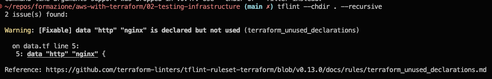
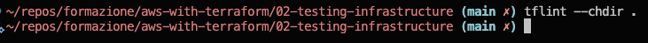
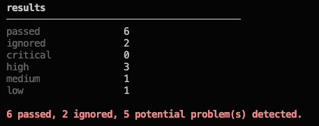
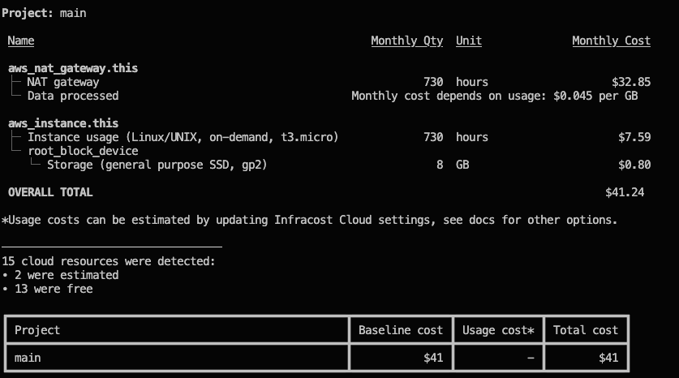

# Third party utilities

This folder contains some terraform configuration to be tested against some third party utilities.

## tflint

[tflint](https://github.com/terraform-linters/tflint) is an utility to do some linting of terrafomr files. 

### Examples

If you straight run:

```console
tflint --chdir .
```

You will receive some warnings like this



But since this is safe to make tflint ignore it you can add a comment above the specified resource:

```
# tflint-ignore: terraform_unused_declarations
data "http" "nginx" {
  url = "http://${aws_instance.this.public_ip}"
  ...
}
```

And now the output will be empty:



## terraform-docs 

Another interesting tool is [terraform-docs](https://terraform-docs.io) to auto generate documentation given a Terraform configuration.

### Examples 

Take a look at [.terraform-docs.yml](.terraform-docs.yml) file and the [documentation](https://terraform-docs.io/user-guide/configuration/). This file is auto injected when running the command:

```console
terraform-docs markdown .
```

And this will auto-generate a markdown file, take a look at [TERRAFORM_DOCS.md](TERRAFORM_DOCS.md).

## tfsec

[tfsec](https://github.com/aquasecurity/tfsec) is an utility to check your infrastructure against known vulnerabilities and help you deploy robust code.

### Examples

Let's take a look if we simply run:

```
tfsec .
```

For readability the output is reduced but this the summary of tfsec:



As you can see some resources are ignored, like tflint also tfsec lets you define which rules need to be ignored. 
For examples, I want my users to be able to call the EC2 IP on port 80 as I deployed a simple html page so I've added a comment:

```terraform
resource "aws_security_group" "this" {
...
  ingress {
    cidr_blocks = ["0.0.0.0/0"] #tfsec:ignore:aws-vpc-no-public-ingress-sgr
    description = "Allow visiting website"
    protocol    = "tcp"
    from_port   = 80
    to_port     = 80
  }
...
}
```

The tfsec output can be formatted as markdown! Take a look at [TFSEC.md](TFSEC.md)

## infracost

[infracost](https://www.infracost.io/docs/) is a command line that lets you breakdown costs of your Terraform configuration, even before deploying it!

### Examples

For this utility you will need additional configuration before starting using it. 
After installing it run command:

```bash
infracost auth login
```

You will be redirect to a login page and an API_KEY will be assigned to your account.
You can then run:

```bash
infracost breakdown --path .
```

And the result will be something like this:



Also a html format can be generated, try opening [cost-breakdown.html](docs/infracost/cost-breakdown.html) on your browser.

## Terraform test

This is not an utility but it is a built-in command of Terraform from version 1.6.0, what is interesting is that previously there was [terratest](https://terratest.gruntwork.io/docs/) and it was in fact a third party utility.

### Examples

Some samples where defined under the folder tests/ (default folder where terraform will look for .tftest.hcl files).

Try run:

```bash
terraform test
```

And wait for all tests to finish. Consider that this will deploy the entire infrastructure so take a break and relax while terraform do all the magic!

If you can't wait how terraform behave, you can run a single 'test-suite' by specifying the file path

```bash
terraform test --filter tests/website.tfstest.hcl
```